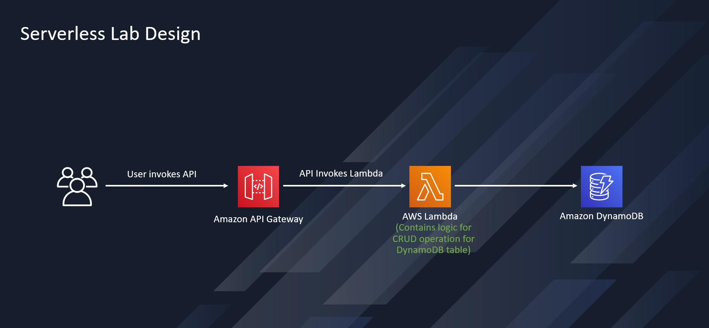

# Serverless CRUD API with AWS Lambda, API Gateway & DynamoDB

A fully serverless REST API built on AWS that performs CRUD operations against a DynamoDB table, using API Gateway as the front door and Lambda for all backend logic. Tested and validated using Postman, with a follow-up load testing exercise to observe performance under repeated requests.

## Architecture



1. A client sends an HTTP request to **Amazon API Gateway**.
2. API Gateway invokes an **AWS Lambda** function.
3. The Lambda function contains the logic to perform CRUD operations against an **Amazon DynamoDB** table, based on the operation specified in the request payload.

## What This API Does

The API accepts a POST request with a JSON payload specifying an `operation`, a `tableName`, and a `payload`. Supported operations:

- `create` – add a new item to the table
- `read` – fetch a single item by key
- `update` – modify an existing item
- `delete` – remove an item
- `list` – scan and return all items in the table
- `echo` / `ping` – simple test operations, not tied to DynamoDB

**Example request (create):**
```json
{
    "operation": "create",
    "tableName": "lambda-apigateway",
    "payload": {
        "Item": {
            "id": "1234ABCD",
            "number": 5
        }
    }
}
```

## Tech Stack

- **Amazon API Gateway** – REST API entry point
- **AWS Lambda** (Python 3.13) – business logic and DynamoDB operations
- **Amazon DynamoDB** – NoSQL data store
- **IAM** – least-privilege custom policy scoped to specific DynamoDB actions and CloudWatch logging
- **Postman** – manual API testing and load testing

## Security

Access is controlled through a custom IAM policy attached to the Lambda execution role, scoped only to the DynamoDB actions the function needs (`GetItem`, `PutItem`, `UpdateItem`, `DeleteItem`, `Query`, `Scan`) plus CloudWatch Logs permissions for observability — following least-privilege principles rather than using a broad managed policy.

## Testing

The API was tested end-to-end using Postman:
- Verified each CRUD operation returns the expected response and HTTP 200 status
- Confirmed data changes by cross-checking the DynamoDB table directly in the AWS console

## Load Testing

Using the same deployed stack, I ran repeated requests against the API through Postman's Collection Runner to observe behavior under load, and reviewed Lambda's CloudWatch metrics (invocation count, duration, error rate) to understand how the function performs under repeated traffic. This is a natural follow-up to a functional CRUD build — moving from "does it work" to "how well does it perform."

## What I Learned

- How API Gateway and Lambda integrate to build a fully serverless API with no managed servers
- Writing least-privilege IAM policies rather than defaulting to broad permissions
- Using Postman for both functional API testing and basic load testing
- Reading CloudWatch metrics to reason about Lambda performance under load

## Credits

Base lab structure and diagram adapted from [Rajdeep Saha's serverless-lab](https://github.com/saha-rajdeep/serverless-lab), used with permission as part of an AWS bootcamp exercise. Implementation, testing, and load testing were completed independently.
